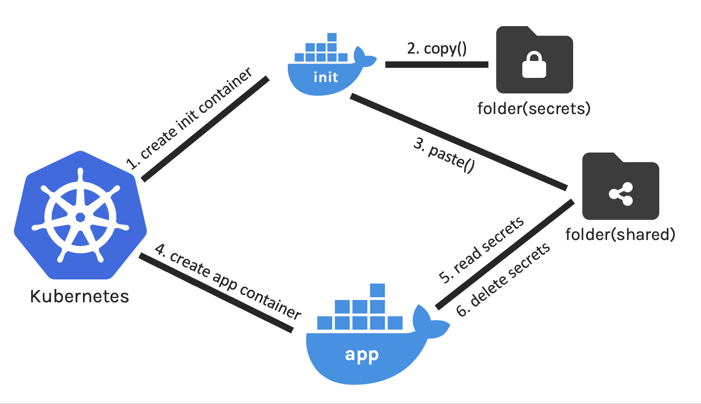

# Title: Backend Developer Intern @ Datascan

# When: June 2022 - August 2022.

#####

## What is Datascan?

We buy our cars from dealerships, and to do so, most of us have to take out a
loan from the bank. The dealerships are no different. To buy cars to fill their
inventory, they take loans from banks just like us. Datascan is a company that
creates tools for these banks to monitor the wholesale lending life cycle. One
of such services is the Wi (Wholesale Intelligence) service. The Wi solution
simplifies the otherwise difficult process of managing outstanding collateral
for the banks. This is the application that I worked on this summer. Throughout
my time at Datascan, I had the opportunity to work on a multitude of projects,
each with its own unique focus.

### Security

There was a critical security bug that was exposing passwords as cleartext in
the internal parts of our application. This was primarily due to how
[Kubernetes](https://kubernetes.io) injected passwords into applications. When
Kubernetes passes secrets to a [Docker](https://www.docker.com) Container, it
mounts a folder containing the secrets, but does not support unmounting to break
the connection between the container and the secrets folder. I implemented the
[k8ssecuresecreader](https://github.com/rahulagnihotri/k8ssecuresecreader)
pattern that resolved this issue using [initContainers](https://www.docker.com).

### Performance

One of my colleagues implemented a [Redis](https://redis.io) cache to speed up
the application when dealing with repetitive, expensive API requests. Using
[VisualVM](https://visualvm.github.io), I assessed whether the cache was a
useful change or was unnecessary complexity. I also wrote some code to make the
cache configurable for each Octopus deployment of Wi.

### Cloud Storage

I wrote a Spring
[@Scheduled](https://docs.spring.io/spring-framework/docs/current/javadoc-api/org/springframework/scheduling/annotation/Scheduled.html)
task that migrated existing users over to
[Azure AD](https://azure.microsoft.com/en-us/services/active-directory/) from
local database on startup. To avoid concurrency issues in multi-container
environments, a single use
[@SchedulerLock](https://github.com/lukas-krecan/ShedLock) was used to ensure
that the task was only attempted in one container.
