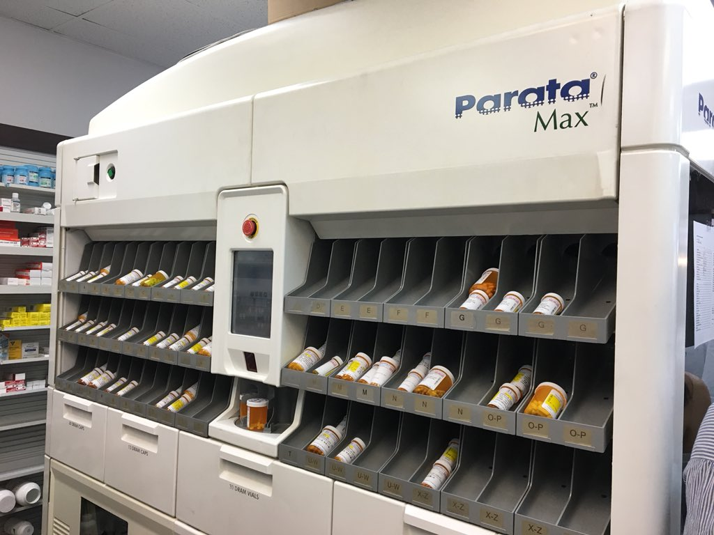
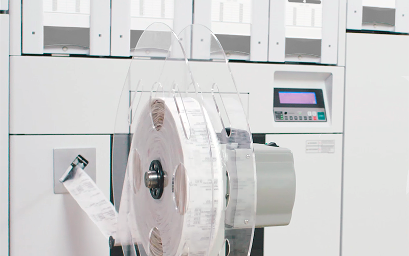
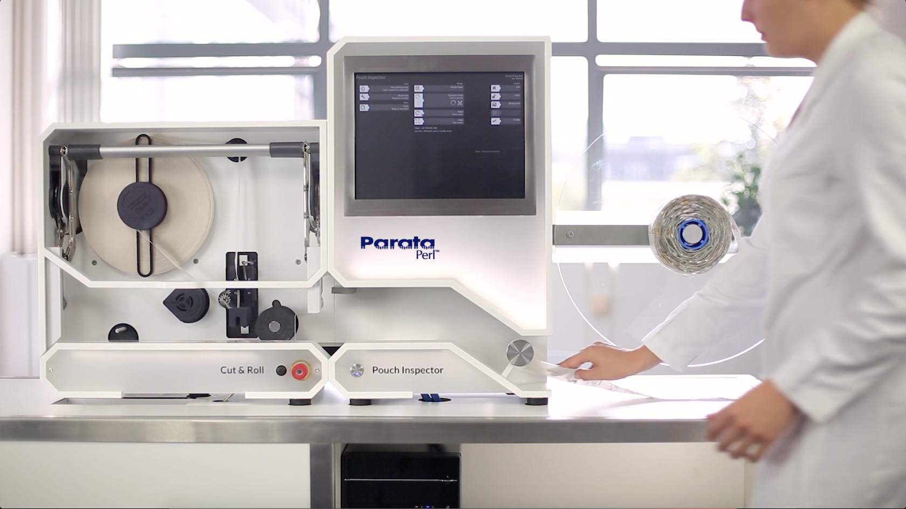
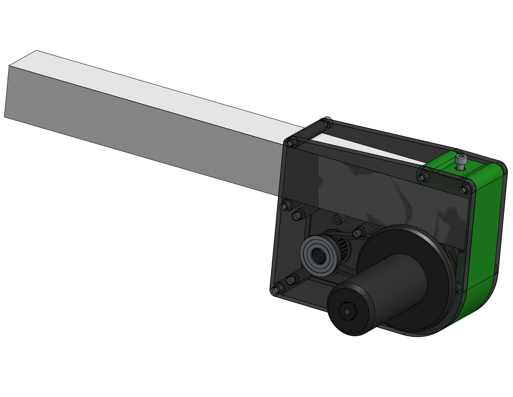

# Title: Automation Engineering Intern @ Parata

# When: June 2021 - August 2021.

#####

## What is Parata?

We all know the classic orange CVS bottle. Have you ever thought about how your
pharamcist goes about getting your order? Well if you thought that they filled
each bottle as an order came in, they would never be able to keep up with the
orders, or even worse, they could get an order wrong. Instead, they use a
machine like the Parata Max that packages pills into bottles automatically.

However, Parata doesn't stop there. They also make machines for long term care
facilities where the use case is completely different. Rather than giving
patients different medications everyday, often they follow a certain routine,
and often these medications are similar across an entire facility. For cases
such as this, Parata's ATP machine puts pills into small pouches and weaves them
into a large spool.

Such a large spool can become hard to manage for the LTC facilities. So the
Parata Perl is used to take such large spools and break them up into smaller
spools. While it's doing this, the Perl also verifies the content of each pouch
using Computer Vision to make sure that the right medications are in the pouch.

## My Role

As an Intern at Parata, my job was to put the Parata Perl through hell. Over the
span of 6 weeks, me and a group of 4 other interns, ran close to 100,000 pouches
through the Perl with the most challenging conditions possible. Simultaneously,
we worked with the engineering team to work out any bugs we discovered, and test
any prototypes.

After we finished running all the tests, I took the data and built a correlation
matrix to identify any errors that all seemed to be occurring in tandem.

But it would be a half-hearted effort to leave those results just there. After
picking one group of errors to focus on, I was able to pinpoint the cause of the
error to the way the spools were being fed into the Perl. Currently, the Perl
was pulling the pouches into the machine using the tiny 2" foam rollers. So with
some really large and heavy spools, the magnitude of the torque was high enough
that the machine's calibrated settings were not effective in this scenario.

Below, you can see my solution: My plan was to create an add on kit that acts as
an active unspooling mechanism into the machine. By controlling the rate at
which the spool unwinds into the machine, we can reduce the tension on the foam
rollers, and better calibrate the machine.

