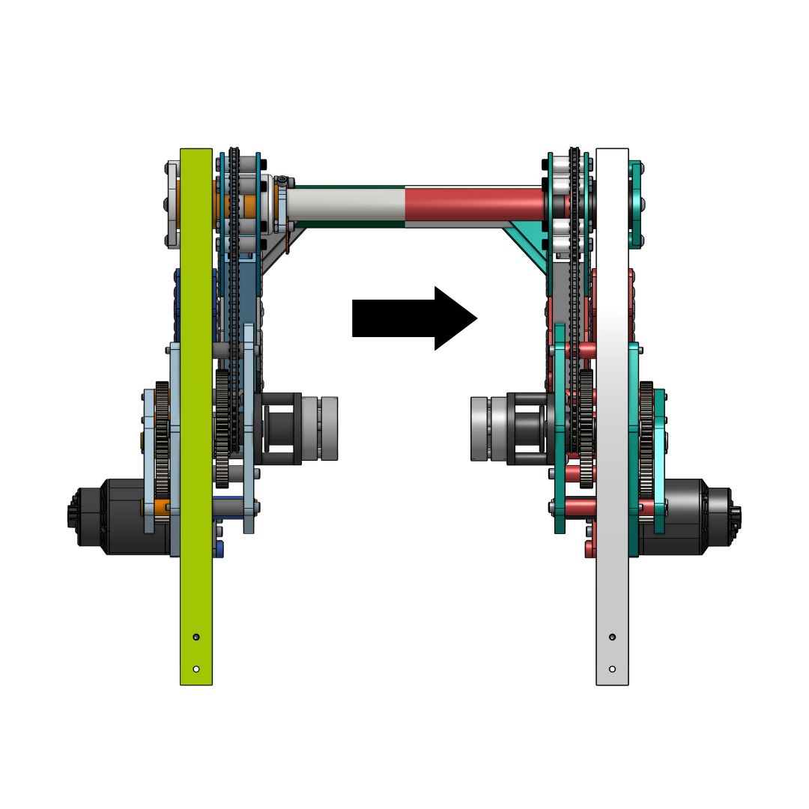

# Project: Abhi's Onshape Features

# Colors:

# Tags: CAD, automation

# Github:

# Deployment:

# GIF:

# Description

I love 3D Design. But what I don't love is the amount of time it takes
sometimes. So, I made a set of tools that makes 3D Modeling a lot faster.

#####

## How I came about starting this project

In high school, I discovered my passion for Competitive Robotics, here is my
team [FRC 5190](https://www.ghrobotics.org), where over the next 4 years, I
built skills in 3D Modeling by using softwares such as
[SolidWorks](https://www.solidworks.com), and later
[Onshape](https://www.onshape.com/en/). When I made the shift to Onshape, I
noticed that I had the ability to write our own features into the program using
the [Featurescript](https://cad.onshape.com/FsDoc/) language. Featurescript is a
language designed by the folks over at Onshape for building and working with 3D
parametric models. The syntax of this language resembles that of Javascript.

## Here are some of my notable creations

Click on each subtitle to see the source code for each custom feature.

### [Drivetrain Generator](https://cad.onshape.com/documents/96d32fd4fe5341563a402ecd/v/67d9e6b8eabf48e030f6ffff/e/1d3de11ced3d680525700399)

In FRC Robotics, one of the building blocks of a robot is a drivebase (chasis)
that allows the robot to move. One of the most popular designs, the WCD, differs
from team to team only by a few differences. Noticing this, I created a tool
that automated the design process that once took 45 minutes, to nothing more
than 20 seconds and couple clicks.

### [Chamfer All](https://cad.onshape.com/documents/96d32fd4fe5341563a402ecd/w/0366fc53bc15b9d91febc38f/e/1e83f1d37bdfac52ab0f1c71)

Do you like getting cut by sharp corners? Well neither do I, so I include
chamfers wherever possible on my designs. However, sometimes, this process of
adding chamfers can take a while, and I could miss a corner by accident. So now,
I can simple select a face to chamfer all the edges I need to.

### [Set Materials](https://cad.onshape.com/documents/96d32fd4fe5341563a402ecd/v/67d9e6b8eabf48e030f6ffff/e/d7f04278e0325b6d4426ca34)

Weight. A very important thing. In the FIRST Robotics Competition, robots are
not allowed to weigh more than 125 lbs. Now it would not be fun if you built a
robot that was only just over the limit. To prevent this, designers set the
materials of each part in CAD. Some of the materials used by FRC designers are
not avaliable by default in Onshape, so the Set Materials feature brings these
materials into Onshape. As a bonus, you can also set the appearance of each
material so you can visualize what your model would look like IRL.

Below you can see the effect of the Set Materials tool on one of my designs.

