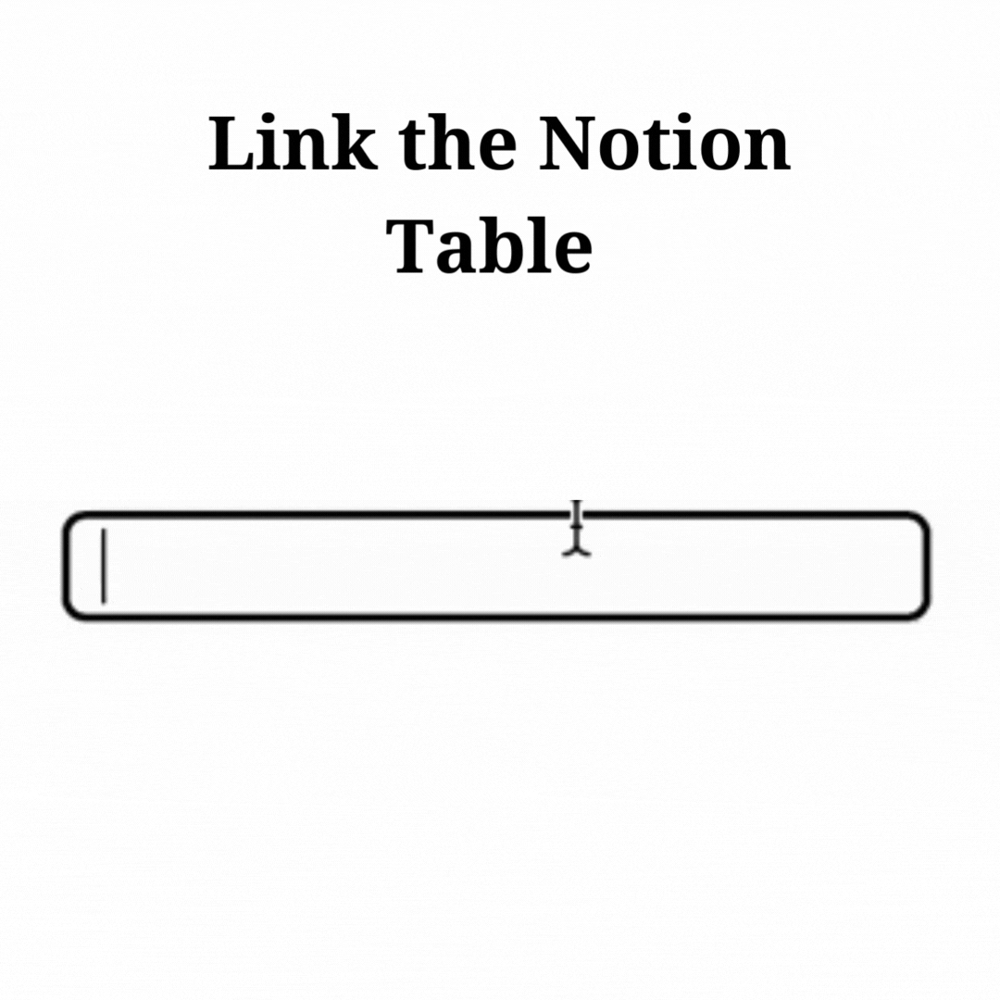

# Project: Cotion

# Colors:

# Tags: react.js, flask

# Github: https://github.com/Cotion-App/frontend

# Deployment: https://cotion.herokuapp.com

# GIF: 

# Description

I sought out to find a website that could automate the process of
uploading my Canvas Assignments to Notion, my task management software, and I stumbled upon
[Edutools for Notion](https://edutools.srg.id.au/guide/assignments-to-db/index.html).
Unfortunately, no matter how long I tinkered with the website, it did not seem
to work for me. So I put together my own Canvas To Notion workflow called Cotion.

#####

## Goals

One feature I wanted the app was the ability to update your Notion table throughout the semester. 
Although some professors release all of their course schedules at the start of
the semester, others release their course schedule in chunks throughout
the semester. If a user used Cotion multiple times throughout the semester, I
wanted Cotion to only add new assignments. For any existing assignments in the
database, Cotion would check to see if there was a change in due date, and
update as necessary.

## The Structure

I am using 2 servers to run Cotion. One server hosts the React.js frontend, and the other hosts the [Flask](https://flask.palletsprojects.com/en/2.1.x/) API that forms the backend. Both of the servers are being hosted for free on [Heroku](https://heroku.com).

## Future Features

In Notion, I find myself categorizing my assignments by type (ie. HW, Tests,
Quizzes, etc.) once I have uploaded the Canvas Assignments to Notion. I want the
ability to assign a preliminary assignment category for each assignment
automatically while using Cotion.
